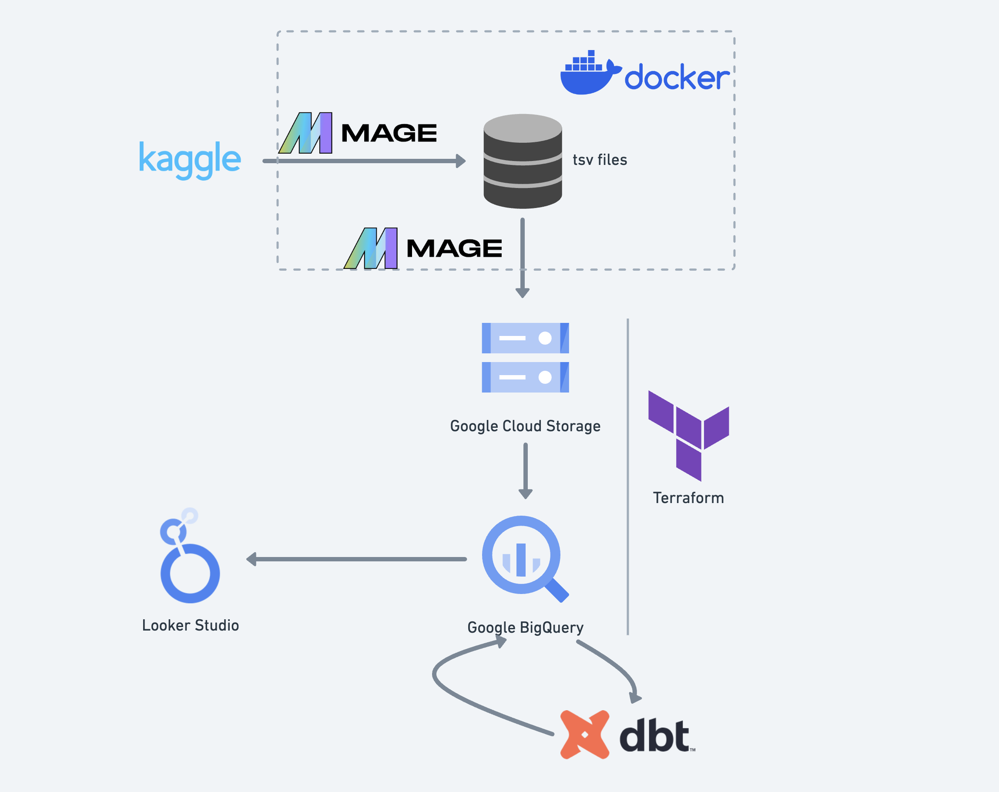
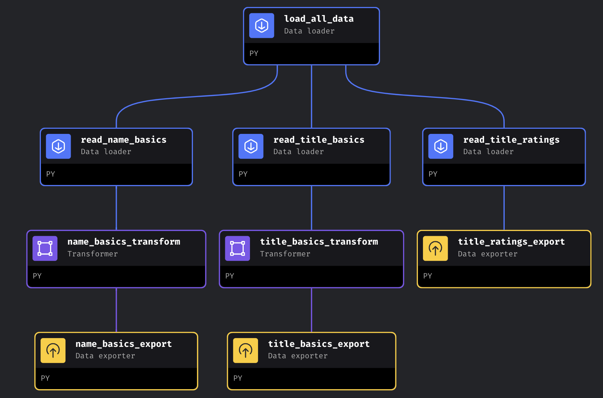
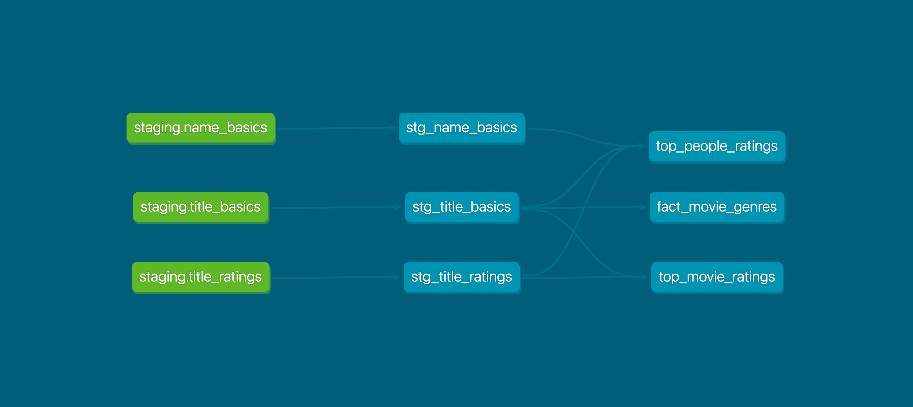
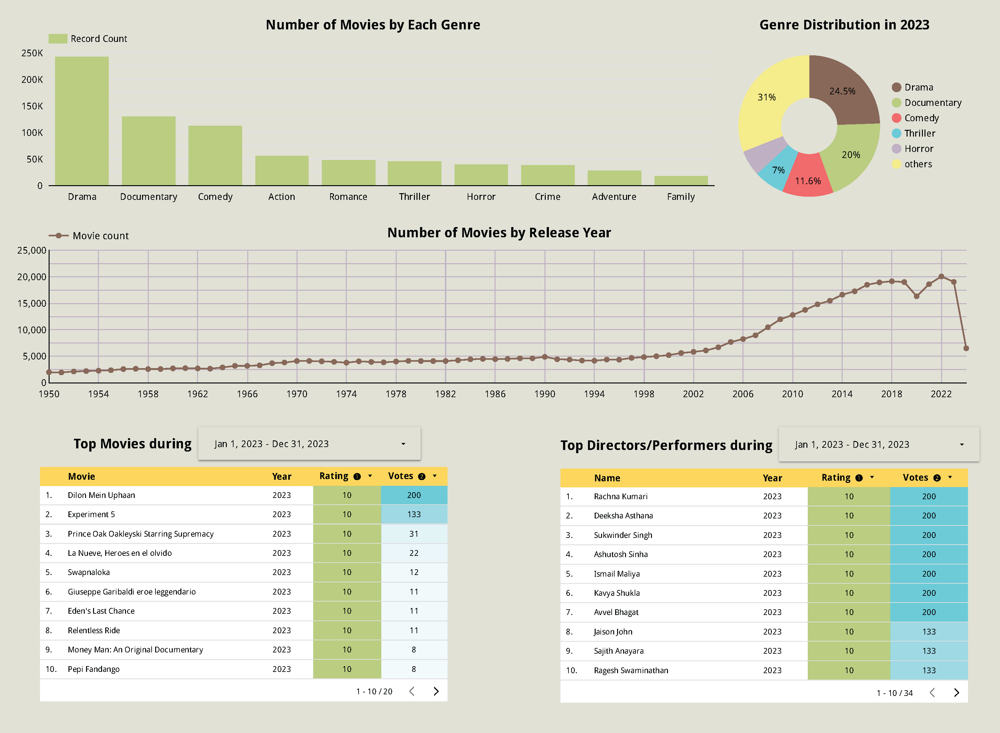
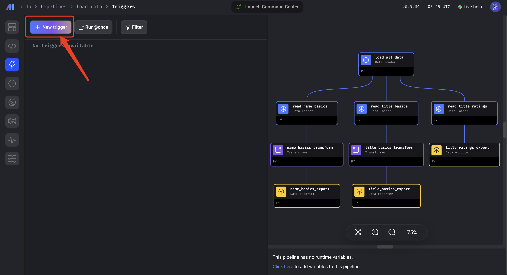
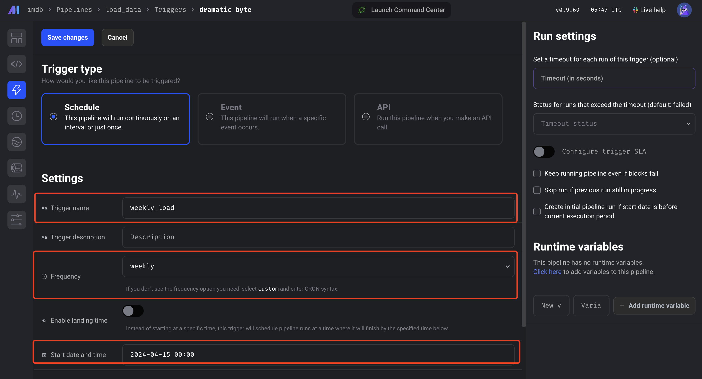
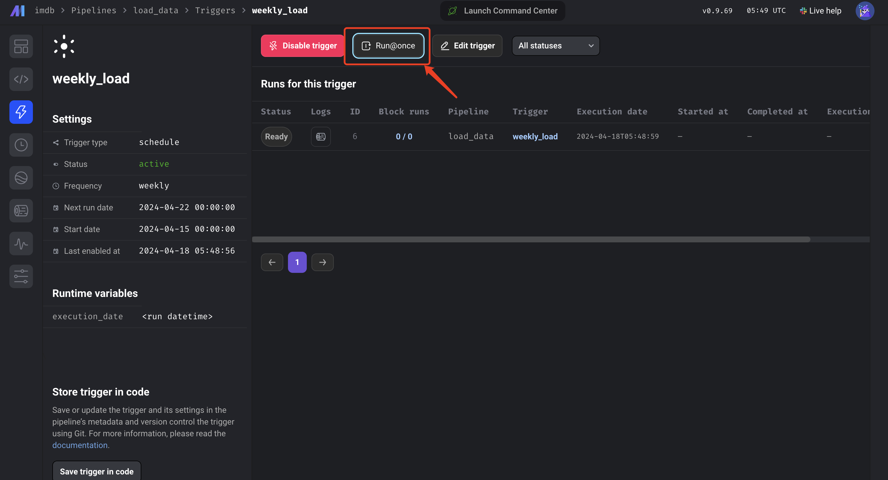
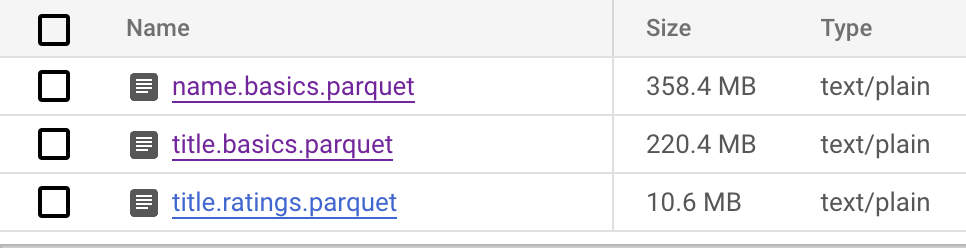

# Data Engineering Project - IMDb movies analysis

- [Data Engineering Project - IMDb movies analysis](#data-engineering-project---imdb-movies-analysis)
  - [Overview](#overview)
  - [Technologies](#technologies)
  - [Architecture](#architecture)
  - [Orchestration Workflow](#orchestration-workflow)
  - [BigQuery Data Warehouse](#bigquery-data-warehouse)
  - [DBT Transformation](#dbt-transformation)
  - [Data Visualization: Dashboards](#data-visualization-dashboards)
  - [How to reproduce this Project](#how-to-reproduce-this-project)
    - [Step 1: Setup environment on Google Cloud VM](#step-1-setup-environment-on-google-cloud-vm)
    - [Step 2: Setup terraform](#step-2-setup-terraform)
    - [Step 3: Kaggle setup](#step-3-kaggle-setup)
    - [Step 4: Mage setup](#step-4-mage-setup)
    - [Step 5: GCS to BigQuery](#step-5-gcs-to-bigquery)
    - [Step 6: DBT transformation](#step-6-dbt-transformation)
    - [Step 7: Visualization](#step-7-visualization)
  - [Reference](#reference)

## Overview

This repository contains the project for the Data Engineering Zoomcamp (Cohort 2024) organized by [DataTalks.Club](https://datatalks.club/) community.

The project is aimed at using IMDB dataset on movies, ratings, and people to solve the following problems: 

- What is the distribution of genres of movies across these years? Which genres are most popular?
- How the movie production volume changes from 1950 till now?
- What are top 10 movies based on ratings and votes, given a specified timeframe?
- Who are top 10 directors/performers based on the ratings and votes for the movies they are known for, given a specified timeframe?

## Technologies
&emsp;Container Development: [Docker](https://www.docker.com/)  
&emsp;Infrastructure as Code: [Terraform](https://www.terraform.io)      
&emsp;Cloud: [Google Cloud Platform](https://cloud.google.com/compute)  
&emsp;Data Lake: [Google Cloud Storage](https://cloud.google.com/storage)     
&emsp;Data Warehouse: [Google BigQuery](https://cloud.google.com/bigquery)  
&emsp;Workflow Orchestration: [Mage AI](https://www.mage.ai/)   
&emsp;Data Transformation: [dbt](https://www.getdbt.com)  
&emsp;Data Visualisation: [Looker Studio](http://lookerstudio.google.com/)  

## Architecture



## Orchestration Workflow



I used Mage AI for the orchestration workflow. First, in `load_all_data`, I loaded all the datasets (name.basics, title.basics, title.ratings) to local as tsv files. After that, three parallel data loaders will read each dataset by chunk and get the dataset in form of Pandas dataframes. The transformers are applied to name.basics and title.basics to select the necessary columns for the project instead of exporting all the columns. Finally, the exporters will export the dataframes to Google Cloud Storage in the format of parquet.

Since the IMDb datasets on Kaggle are updated weekly, I add a trigger to the pipeline so that it will execute weekly.

## BigQuery Data Warehouse

Tables have been created in BigQuery based on the parquet files loaded to GCS. The ddl scripts are available in [gcs_to_bq.sql](gcs_to_bq.sql)

Since the dataset doesn't have any datetime types of data and considering the data volumes, it is not necessary to partition on the data here. Clustering is applied to name.basics and title.basics based on birthYear and startYear respectively.

## DBT Transformation

Data transformations are done in DBT to prepare the data for visualizations. The staging models normalize the datasets on the column names, deal with null values, and cast each variable to an appropriate type. The core models connect movies with their genres, extract top movies based on highest ratings and votes, and top people related to high-rating movies. The lineage of models is shown below:




## Data Visualization: Dashboards

[Looker Studio Dashboard](https://lookerstudio.google.com/reporting/18545f81-afde-4f8d-95cd-d30e2d7e46cc)



From the dashboard, we can solve the problems for this project:
  - Overall, Drama, Documentary, Comedy are top 3 genres with most movies both across all years and in 2023.
  - Movie production increases steadily each year since 1950, but has a decrease in 2020, which is reasonable considering of the pandemic.
  - The top movie in 2023 is Dilon Mein Uphaan, with rating of 10 and 200 votes.
  - The top director/Performer in 2023 is Rachna Kumari, whose movies had an average rating of 10 and 200 votes in total.

## How to reproduce this Project

### Step 1: Setup environment on Google Cloud VM

I would suggest following the tutorial from Data Engineering Zoomcamp to finish setting up the environment on Google Cloud Virtual Machine.

[](https://youtu.be/ae-CV2KfoN0&list=PL3MmuxUbc_hJed7dXYoJw8DoCuVHhGEQb&index=14)

Basically, this includes:

1. Create new project on Google Cloud Platform. Give it a name and remember the project id.

2. Create a virtual machine on GCP and connect to it with SSH. For this project, I used `e2-highmem-4` as the machine type since it has higher memory. If the memory is low, the dataset may fail to be loaded. Also, I set `30GB` for the disk size.

3. Install Anaconda, Docker, docker-compose, and Terraform

==================== Covered in the tutorial ====================

4. Create a google service account (IAM & Admin > Service accounts > Create service account.) For the service account, I just grant the owner role to it, but it would be better if it is granted with some certain roles. For this project, the service account should at least have the following roles: **Viewer, BigQuery Admin, Storage Admin, Storage Object Admin, Compute Admin**.

5. Create and download the Service Account key file (json format). Put it somewhere in the directory, e.g. `.gc/de-project.json`.

6. Set `GOOGLE_APPLICATION_CREDENTIALS` to point to the credential file:

  ```bash
  export GOOGLE_APPLICATION_CREDENTIALS=~/.gc/de-project.json
  ```
  
  Now authenticate:
  ```bash
  gcloud auth activate-service-account --key-file $GOOGLE_APPLICATION_CREDENTIALS
  ```

7. Clone the project and go to project's directory

  ```bash
  git clone https://github.com/julia-ychi/data_engineering_imdb.git
  cd data_engineering_imdb
  ```

### Step 2: Setup terraform

1. Go to terraform directory and modify [terraform/variables.tf](./terraform/variables.tf) file. Replace every `<CHANGE VALUE HERE>` with your own variables. This includes **project id**, **region**, **location**, **BigQuery dataset name**, and **GCS bucket name**.

2. Refresh service-account's auth-token for this session:

  ```bash
  gcloud auth application-default login
  ```

  Run Terraform commands to create the infrastructure.

  ```bash
  terraform init
  terraform plan
  terraform apply
  ```

### Step 3: Kaggle setup

On [Kaggle](https://www.kaggle.com/) go to [Account Settings](https://www.kaggle.com/settings/account) and create new API token.
Download the credential file `kaggle.json` and keep it somewhere.

### Step 4: Mage setup

1. Go to mage_imdb directory, and modify the last line of [dev.env](./mage_imdb/dev.env), set `GCS_BUCKET_NAME` as the one you used in [terraform/variables.tf](./terraform/variables.tf) for `gcs_bucket_name`.

2. Rename dev.env file to .env
  ```bash
  mv dev.env .env
  ```
3. Create two files: `google-cred.json` and `kaggle.json`. Make sure these two files are directly under mage_imdb directory. 
  ```bash
  touch google-cred.json
  touch kaggle.json
  ```
4. Copy the content in the Google service account credential file to `google-cred.json`. Copy the content of Kaggle credential file to `kaggle.json`.
5. Build docker images. After running the following two commands, open https://localhost:6789
  ```bash
  docker-compose build
  docker-compose up
  ```
6. On the main page of Mage, navigate to Triggers section and create a new trigger by clicking on `+ New trigger`. Configure the trigger to make it run weekly on Monday. After activating the trigger, click `Run@once` to run the pipeline so that the data can be loaded. This may take 5-10 minutes.




### Step 5: GCS to BigQuery

Once the Mage pipeline executes successfully, you can navigate to Google Cloud Storage and will see there are three parquet files in the bucket. 

Navigate to Google BigQuery and copy [gcs_to_bq.sql](gcs_to_bq.sql) to a new query. Remember to replace `<project-id>`, `<bq-dataset-name>` and `<gcs-bucket-name>` with your infrastructure. After running this, BigQuery tables will be created.

### Step 6: DBT transformation

(For this section, you may need to create your own repo on GitHub or fork this repo)

1. Create a free individual dbt cloud account from their [website](https://www.getdbt.com/pricing).
Once you have logged into dbt cloud you will be prompt to create a new project.

2. Name the project, choose BigQuery as the data warehouse, and upload the credential file for the service account created earlier.

3. Add this repository using git clone (SSH). You may get a deploy key, head to your GitHub repo and go to the settings tab. Under security you'll find the menu deploy keys. Click on add key and paste the deploy key provided by dbt cloud. Make sure to select "Allow write access".

4. After finishing setting up, make sure this project is linked to the subdirectory `dbt/`.

5. Go to Cloud IDE, make sure the project is rooted on the subdirectory `dbt/` instead of the repository. If not, you can add the subdirectory in settings at the upper right corner.

6. If you create your own repo, you need to run `dbt init` first. Then add [staging](./dbt/models/staging/) and [core](./dbt/models/core/) folders as well as the files under them to [models](./dbt/models/) folder based on the structure in this repo. Remember to change `name` in [dbt_project.yml](./dbt/dbt_project.yml). After these, skip to step 8.

7. If you fork the repo and have all the dbt project files same as here in Cloud IDE, you don't need to run `dbt init`.
8. Change `database` and `schema` in [dbt/models/staging/schema.yml](./dbt/models/staging/schema.yml). The `database` should be your Google Cloud project id, and `schema` should be BigQuery dataset name.
9. In the command line at the bottom, run
  ```bash
  dbt build --vars '{'is_test_run': 'false'}'
  ```
  The views and tables should be generated into a BigQuery dataset with name starting with `dbt_`.

10. You can deplot the project by creating an environment and a job so that it will run automatically to keep data updated.

### Step 7: Visualization

In Looker Studio, connect to your BigQeury and add the dbt-transformed dataset. Then you can start creating the dashboard.

## Reference
[Data Engineering Zoomcamp GitHub repo](https://github.com/DataTalksClub/data-engineering-zoomcamp/tree/main)